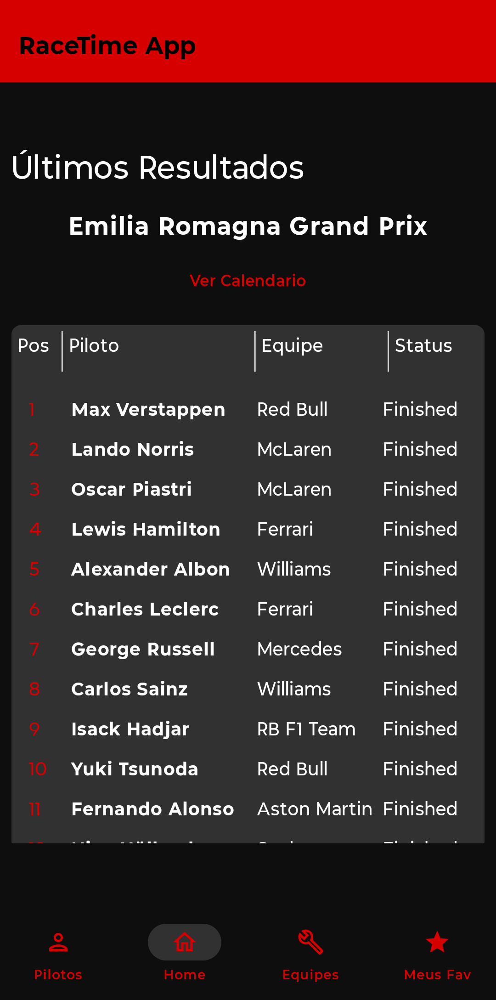
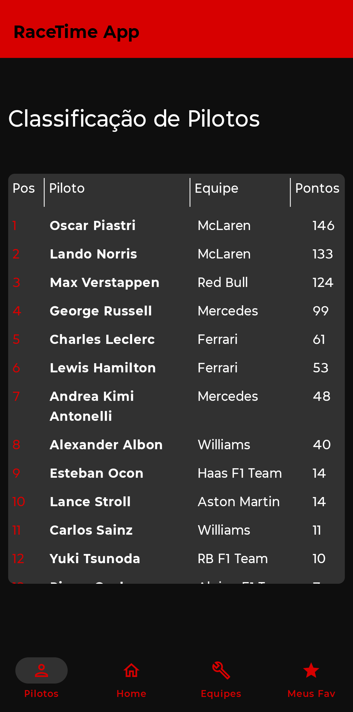
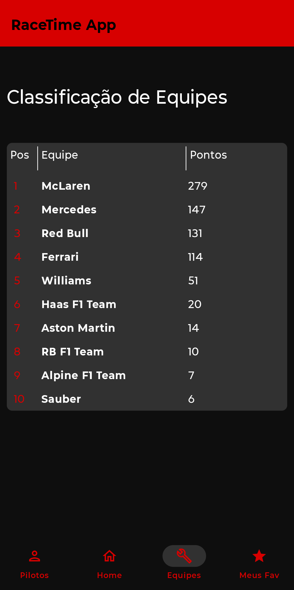
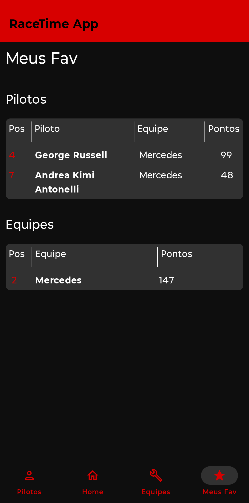
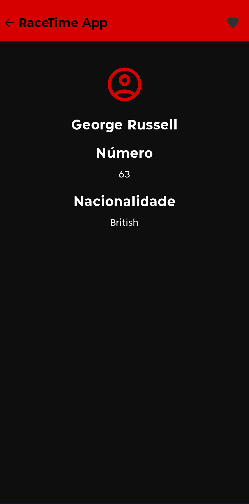
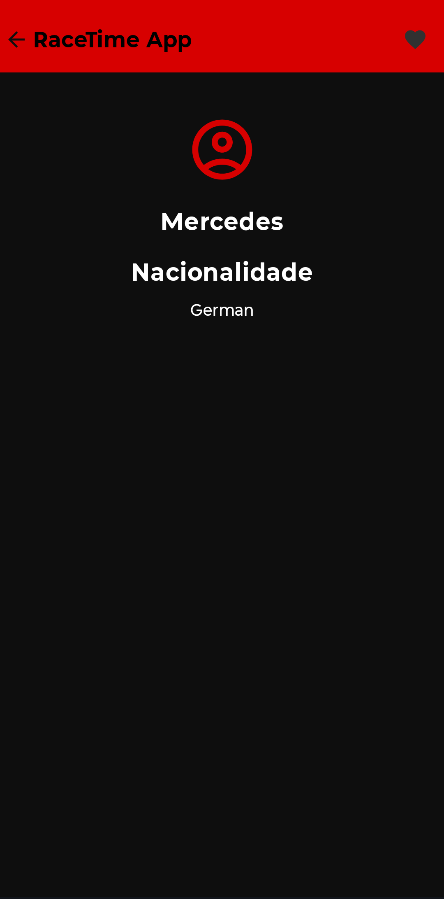

# RaceTimeApp

---

EN 🇺🇸

Disclaimer: This app was created by a fan, for other Formula 1 fans. We have no affiliation with Formula 1, the FIA, or any official team. All names, logos, trademarks, and related content are the property of their respective owners. All rights reserved.

RaceTime App is an app for Formula 1 fans, designed to track the results of race weekends!

App developed to learn best practices using the mvvm architecture and the use of external APIs.

## Available languages:

- Brazilian Portuguese
- French
- English
- Spanish
- Italian

## Tools used:

- Ktor
- SharedPreferences
- Navgation
- MaterialTheme

---

PT-BR 🇧🇷

Aviso Legal: Este aplicativo foi criado por um fã, para outros fãs da Fórmula 1. Não possuímos qualquer vínculo com a Fórmula 1, FIA ou qualquer equipe oficial. Todos os nomes, logotipos, marcas registradas e conteúdos relacionados à Fórmula 1 pertencem aos seus respectivos proprietários. Todos os direitos reservados.

RaceTime App é um aplicativo para fãs de Formula 1, feito para acompanhamento dos resultados dos finais de semana de corrida!

App desenvolvido para o apendizado de boas praticas usando a arquitetura mvvm, e o uso de Apis externas.

## Idiomas disponiveis:

- Português Brasil
- Françês
- Inglês
- Espanhol
- Italiano

## Ferramentas usadas:

- Ktor
- SharedPreferences
- Navgation
- MaterialTheme

## UI:

### home

### Classificação de Pilotos

### Classificação de Construtores

### Favoritos

### Piloto

### Construtor

 
